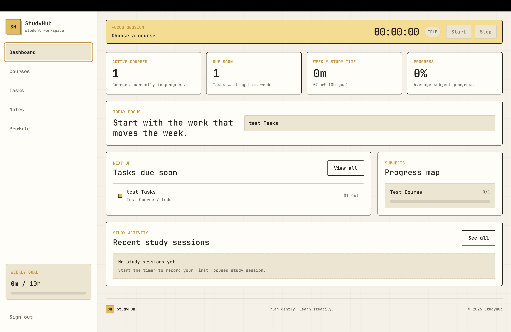
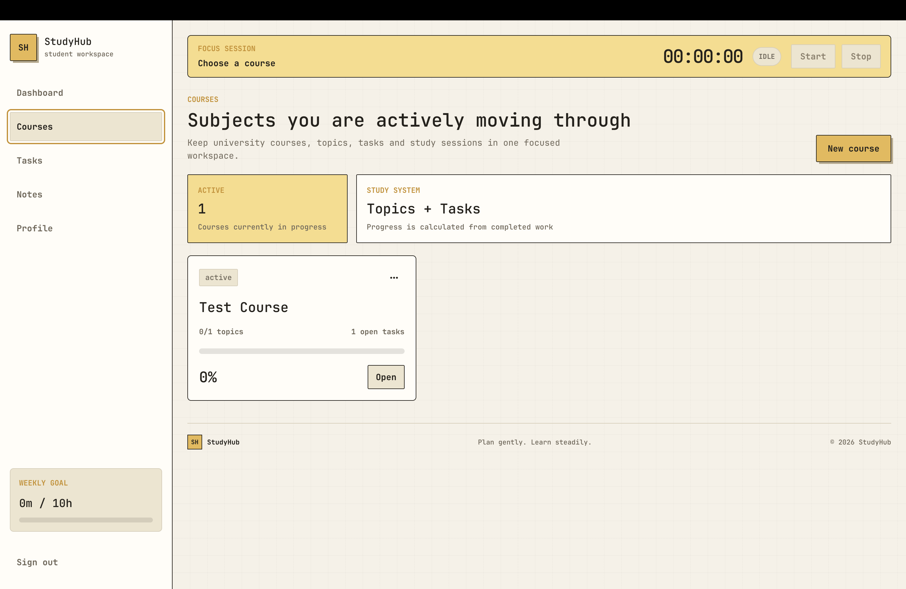
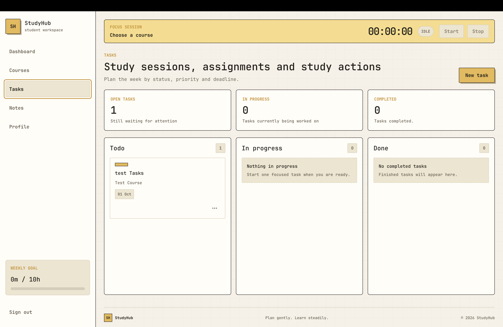
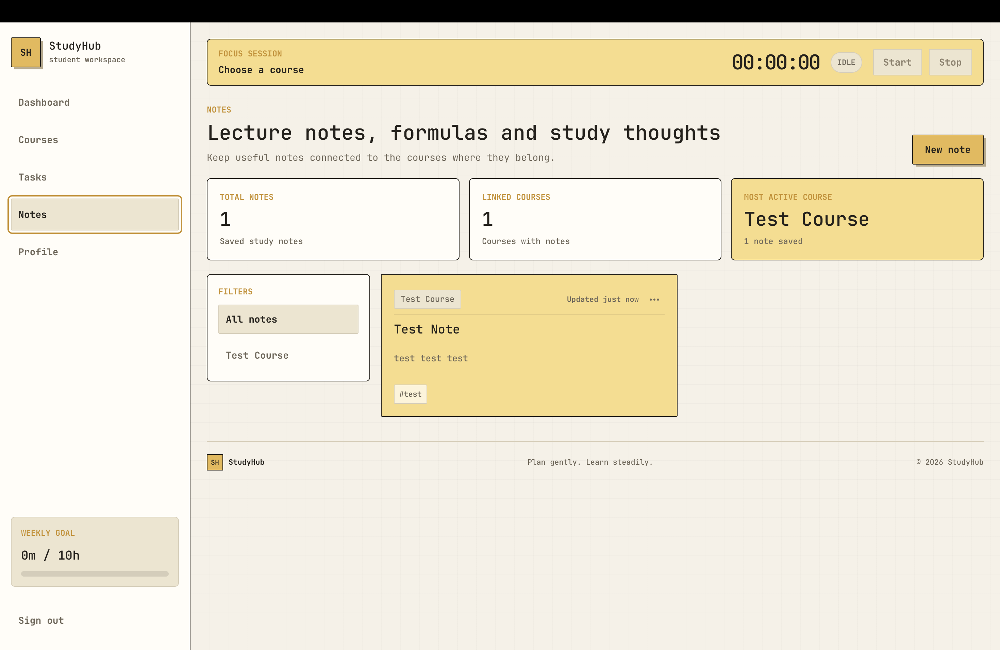
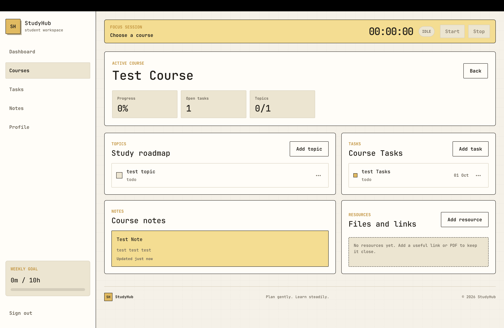

# StudyHub

> A focused learning workspace for organizing courses, tasks, notes, study sessions, and progress in one calm place.

StudyHub is a portfolio project built for university students and self-learners. It turns the usual scattered notes, deadlines, and study plans into a small learning CRM with a clear paper-inspired interface.

## Highlights

- **Dashboard** — active courses, upcoming tasks, weekly study time, progress, and recent sessions at a glance.
- **Courses** — create, edit, and delete courses; manage topics, course tasks, notes, links, and PDFs from one page.
- **Tasks** — organize work across Todo, In progress, and Done states with due dates and priorities.
- **Notes** — write course-linked notes, tag them, filter by course, and see relative update time.
- **Focus timer** — select a course, track a session, and save its duration to study history.
- **Resources** — save useful links or upload private PDF resources with signed URLs.
- **Profile** — update name, learning goal, weekly target, and avatar.
- **Responsive navigation** — a fixed desktop sidebar and a mobile off-canvas menu.

## Screenshots



<p>
  
  
</p>

<p>
  
  
</p>

## Tech Stack

- **Angular 20** and **TypeScript**
- **Angular Signals** for shared reactive state
- **Reactive Forms** for validation and CRUD forms
- **Angular Router** with an authentication guard
- **Supabase Auth** for email/password sign-up, sign-in, and sessions
- **Supabase PostgreSQL** for application data
- **Supabase Storage** for private avatar and PDF uploads
- **Row Level Security** so each user can access only their own data

## Data Model

The app uses the following Supabase tables:

`profiles` · `courses` · `topics` · `tasks` · `notes` · `resources` · `study_sessions`

Every user-owned row contains a `user_id`. Course-related records additionally reference `course_id`.

## Architecture Notes

- The project follows a feature-based Angular structure: `features`, `core`, `shared`, and `layouts`.
- `StudyHubDataService` is the single source of truth for courses, tasks, topics, notes, resources, profile data, and study sessions.
- UI components consume signals from the service, so successful Supabase mutations update the screen without a page refresh.
- Forms prevent duplicate save and delete requests by exposing `Saving...` and `Deleting...` states.
- Private PDFs are opened with short-lived Supabase signed URLs rather than public file URLs.

## Run Locally

### 1. Install dependencies

```bash
npm install
```

### 2. Configure Supabase

Create `src/environments/environment.ts`:

```ts
export const environment = {
  supabaseUrl: 'https://your-project.supabase.co',
  supabasePublishableKey: 'your-supabase-publishable-key',
};
```

Configure the required tables, owner-only RLS policies, and private Storage buckets in your Supabase project before starting the app.

### 3. Start the development server

```bash
npm start
```

Open `http://localhost:4200` in your browser.

## Production Build

```bash
npm run build
```

The production files are generated in `dist/studyhub`.

---

Built as a portfolio project to demonstrate practical Angular, Supabase, authentication, CRUD, and state-management skills.
